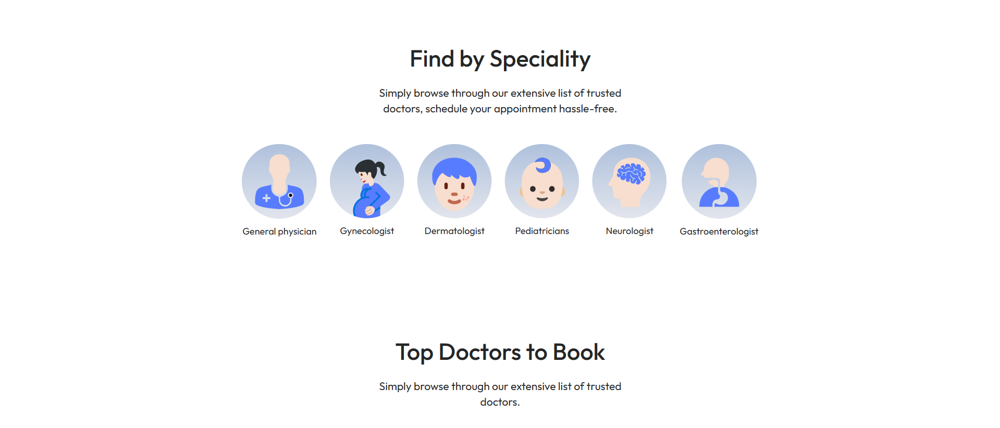
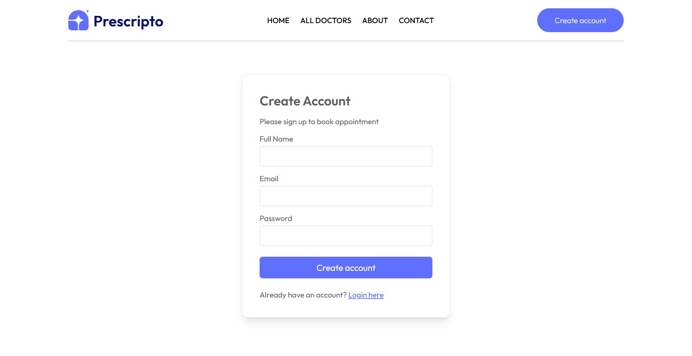
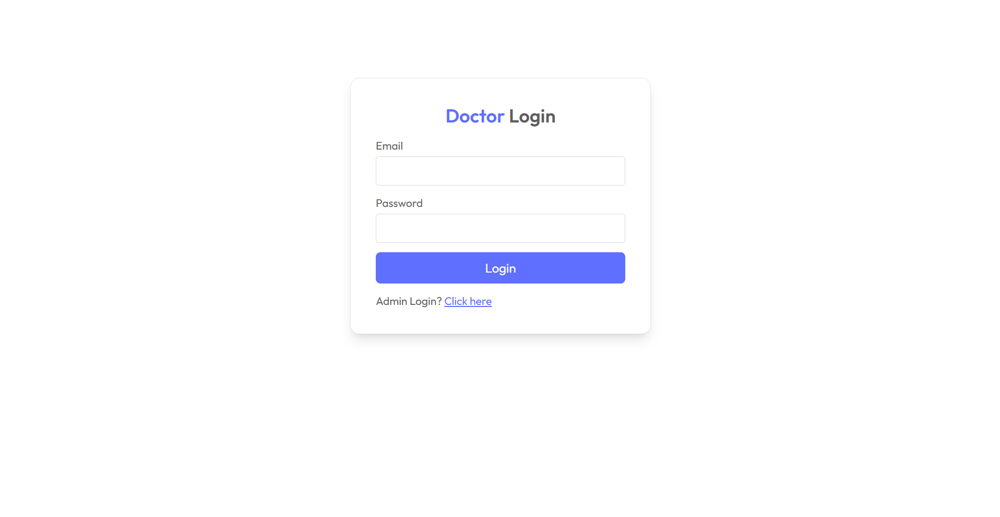
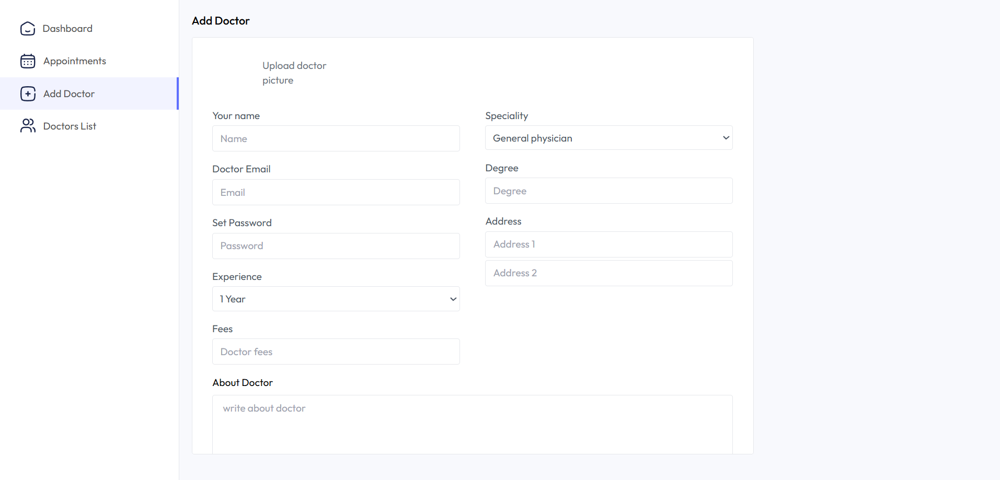

# 🩺 Prescripto – Doctor Appointment System  

Prescripto is a **full-stack doctor appointment management system** that simplifies patient onboarding, appointment booking, and doctor–admin management with modern dashboards. It supports **secure payments, image uploads, and role-based authentication**, making healthcare management seamless and efficient.  

🌐 **Live Demo:** [User App](https://prescripto-frontend-livid-ten.vercel.app/) | [Admin Dashboard](https://prescripto-admin-sage.vercel.app/)  

---

## ✨ Features  

- 🔒 **Role-based Authentication** – Secure JWT auth for **Admin, Doctor, and User**  
- 👨‍⚕️ **Doctor Dashboard** – Manage schedule, availability, and patient appointments  
- 🛠️ **Admin Dashboard** – Control doctors, users, and reports  
- 💳 **Secure Payments** – Integrated with **Razorpay & Stripe**  
- ☁️ **Cloud Storage** – Upload and manage images via **Cloudinary**  
- 📱 **Responsive UI** – Works smoothly across all devices  

---

## 🖥️ Screenshots  

### 🏠 Homepage  
| Home 1 | Home 2 |
|--------|--------|
|  |  |  
| Home 3 | Home 4 |  
|  |  |  
| Home 5 |  
|  |  

---

### 🩺 Doctor Dashboard  
| Doctor Dashboard |
|------------------|
|  |  

---

### 🛠️ Admin Dashboard  
| Admin 1 | Admin 2 |
|---------|---------|
|  |  |  

---

## 🚀 Tech Stack  

### **Frontend**  
- ⚛️ React.js  
- 🎨 Tailwind CSS  
- 🔗 Axios  

### **Backend**  
- 🟢 Node.js  
- 🚀 Express.js  
- 🍃 MongoDB with Mongoose  
- 🔑 JWT for Authentication  

### **Others**  
- 💳 Razorpay & Stripe – Payment Gateway  
- ☁️ Cloudinary – Image Uploads  

---

## 📦 Installation & Setup  

1. **Clone the repository**  
git clone https://github.com/Deepanshu-Gunwant/prescripto.git

cd prescripto

2. **Install dependencies** (both client & server)  
npm install

3. **Run the backend server** (in one terminal)  
npm run server

4. **Run the frontend client** (in another terminal)  
npm start

---

## 👨‍💻 Developer  

Made with 💙 by **[Deepanshu Gunwant](https://github.com/Deepanshu-Gunwant)**  

🌐 **Live Projects:**  
- User App – [https://prescripto-frontend-livid-ten.vercel.app/](https://prescripto-frontend-livid-ten.vercel.app/)  
- Admin Dashboard – [https://prescripto-admin-sage.vercel.app/](https://prescripto-admin-sage.vercel.app/)  

---
